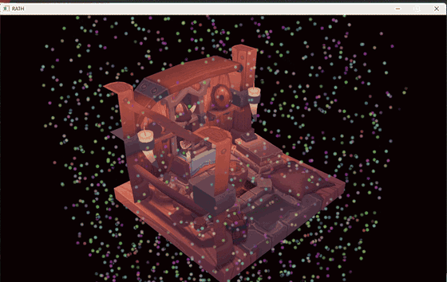

# Rath

  

A Vulkan renderer in C++, built as the foundation for a game engine.

## About

Rath is being built toward a game engine, so the renderer lives in an engine library with a
separate sandbox application on top of it rather than one program. The sandbox is the first
consumer of the engine's API, which keeps that API usable from outside the engine's own code.

Currently only a simple renderer exists. The direction I am interested long term is large open
world rendering and generation capabilities.

My Progress and Documentation: https://www.adrianyip.dev/devlog/index.html#Rath

## Implemented

- Simple asset manager that stores model and texture
- ImGui integration
- Custom material and model objects (R_Material and R_Model) that are craeated with createInfo structs
- Camera class with WASD movement + camera rotations with right mouse button held
- Compute Shaders with particle simulation
- Multisampling
- Mipmaps
- OBJ model loading with vertex deduplication
- Texture mapping
- Depth buffering
- Staging buffer uploads to GPU memory
- Frames in flight with fences and semaphores
- Swapchain recreation on resize
- Validation layers

## Architecture

The engine is a library and the sandbox is a small app that links it. 
Core : application loop, platform detection, defines
Platform : window
Renderer : Vulkan code.

Each Vulkan resource gets its own class. Image creation is a utility shared by the 
swapchain and textures. The device owns the command pool, since member initialization 
order ruled out passing it down.

## Credits

The Vulkan feature path follows [vulkan-tutorial.com](https://vulkan-tutorial.com/). The engine
structure, class decomposition, and build setup are my own.

[Viking room](https://sketchfab.com/3d-models/viking-room-a49f1b8e4f5c4ecf9e1fe7d81915ad38)
by [nigelgoh](https://sketchfab.com/nigelgoh), licensed
[CC BY 4.0](https://creativecommons.org/licenses/by/4.0/), taken from vulkan-tutorial.com's
resized copy.

Dependencies:

- [enginemath](https://github.com/AdrianYip1/enginemath) - my math library (submodule)
- [GLFW](https://github.com/glfw/glfw) - windowing and input (submodule)
- [stb_image](https://github.com/nothings/stb) - texture loading (vendored)
- [tinyobjloader](https://github.com/tinyobjloader/tinyobjloader) - OBJ loading (vendored)

